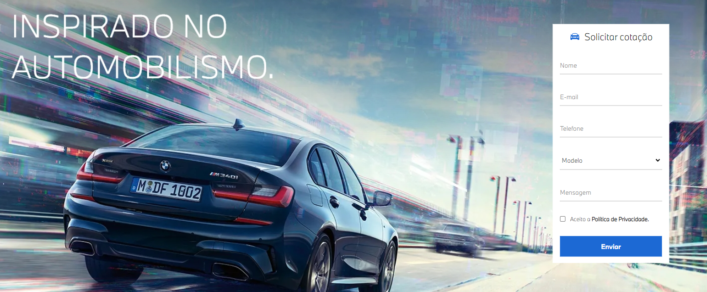

<h1 align="center">
  
</h1>

# Sobre o Projeto

Alpes One - é um página/aplicação para receber cotações de carros.

Projeto foi desenvolvido baseado em um layout projeto por um designer da empresa. Este projeto foi um desafio técnico para a empresa Alpes One.
<br>
<br>

## Pré-requisitos:

Antes de começar, você vai precisar ter instalado em sua máquina as seguintes ferramentas:

[Git](https://git-scm.com). <br>
Além disto é bom ter um editor para trabalhar com o código como [VSCode](https://code.visualstudio.com/) e dentro do VSCode, ter instalado a extensão "Watch Sass" e o Live Server.

```
# Clone este repositório
$ git clone <https://github.com/lhenriquedev/desafio-alpes-one.git>

# Acesse a pasta do projeto no terminal/cmd
$ cd desafio-alpes-one

# Abra com o Live Server
```

## 🛠 Tecnologias

As seguintes ferramentas foram usadas na construção do projeto:

- HTML
- CSS
- JavaScript
- Sass/Scss
